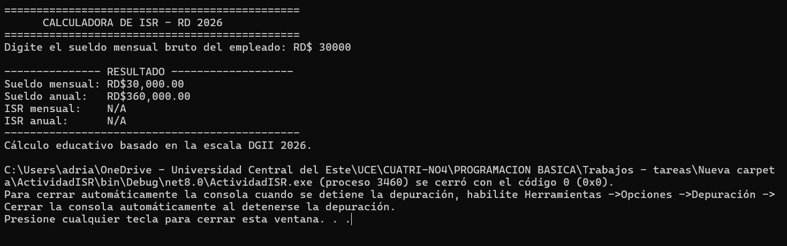
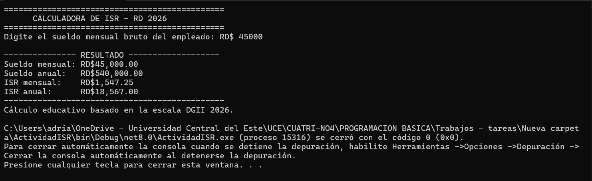
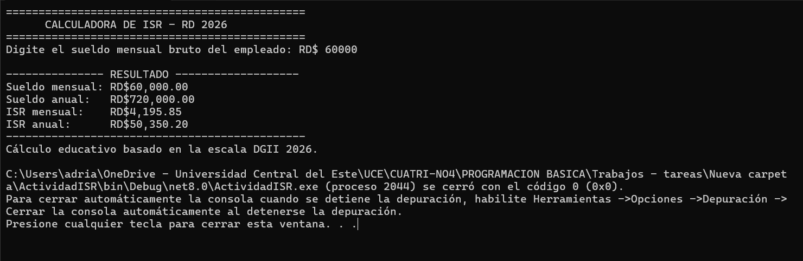
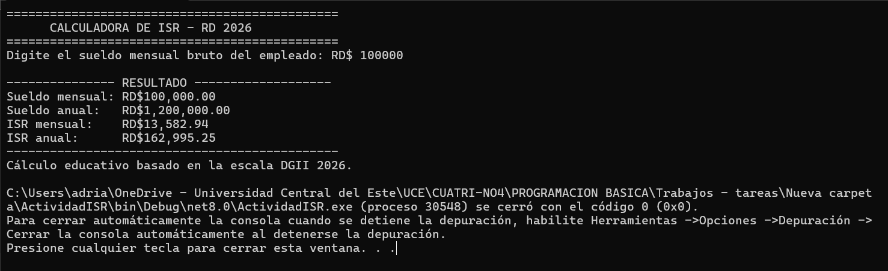

# Calculadora de ISR - República Dominicana 2026

## Descripción

Este proyecto consiste en un programa de consola desarrollado en **C#** que solicita el sueldo mensual bruto de un empleado, calcula su sueldo anual y determina el monto correspondiente al **Impuesto Sobre la Renta (ISR)**.

El cálculo se realiza mediante estructuras de control condicionales y utiliza la escala anual del ISR aplicada en República Dominicana para el año 2026. Cuando el sueldo no alcanza el mínimo gravado, el programa muestra **N/A**.

## Objetivo

Aplicar los conocimientos básicos de programación relacionados con:

- Entrada y salida de datos.
- Variables y operaciones aritméticas.
- Validación de datos.
- Estructuras condicionales `if`, `else if` y `else`.
- Formato de moneda dominicana.
- Cálculo de impuestos por escala progresiva.

## Escala utilizada

| Sueldo anual | Cálculo del ISR |
|---|---|
| Hasta RD$416,220.00 | Exento |
| Desde RD$416,220.01 hasta RD$624,329.00 | 15% del excedente de RD$416,220.01 |
| Desde RD$624,329.01 hasta RD$867,123.00 | RD$31,216.00 más el 20% del excedente de RD$624,329.01 |
| Desde RD$867,123.01 en adelante | RD$79,776.00 más el 25% del excedente de RD$867,123.01 |

## Funcionamiento del programa

1. El usuario introduce el sueldo mensual bruto.
2. El programa valida que el valor sea numérico y mayor que cero.
3. El sueldo mensual se multiplica por 12 para obtener el sueldo anual.
4. Se identifica el tramo correspondiente de la escala del ISR.
5. Se calcula el ISR anual.
6. El ISR anual se divide entre 12 para obtener el ISR mensual.
7. Se muestran en pantalla el sueldo mensual, el sueldo anual, el ISR mensual y el ISR anual.

## Cómo ejecutar el proyecto

1. Abrir el proyecto en **Visual Studio 2022**.
2. Verificar que esté instalado **.NET 8.0** o una versión compatible.
3. Abrir el archivo `ActividadISR.csproj`.
4. Presionar `Ctrl + F5`.
5. Introducir un sueldo mensual y presionar `Enter`.

También se puede ejecutar desde una terminal ubicada en la carpeta del proyecto:

```bash
dotnet run
```

## Escenarios de prueba

### Escenario 1: empleado exento

**Sueldo mensual introducido:** RD$30,000.00  
**Resultado:** No aplica ISR.



### Escenario 2: primer tramo gravado

**Sueldo mensual introducido:** RD$45,000.00  
**ISR mensual calculado:** RD$1,547.25  
**ISR anual calculado:** RD$18,567.00



### Escenario 3: segundo tramo gravado

**Sueldo mensual introducido:** RD$60,000.00  
**ISR mensual calculado:** RD$4,195.85  
**ISR anual calculado:** RD$50,350.20



### Escenario 4: tramo superior

**Sueldo mensual introducido:** RD$100,000.00  
**ISR mensual calculado:** RD$13,582.94  
**ISR anual calculado:** RD$162,995.25



## Validación de entrada

El programa muestra un mensaje de error cuando el usuario introduce letras, un sueldo igual a cero o un sueldo negativo.

## Tecnologías utilizadas

- C#
- .NET 8.0
- Visual Studio 2022
- Git
- GitHub

## Integrantes

- Brayan Mateo - 2025-0224
- Michael Alberto - 2025-0254
- Rey Abimhael - 2025-0736
- Adian Adelso Ortega - 2025-0118
- Adrian Rafael Sarit - 2025-1645

## Asignatura

**Programación Básica (ISW-122-1)**

## Profesor

**Gamalier Reyes del Carmen**

## Repositorio

[github.com/KripyCoding/Tarea-2---Flujo-de-control-1](https://github.com/KripyCoding/Tarea-2---Flujo-de-control-1.git)

## Nota

Este programa fue realizado con fines educativos para practicar el uso de estructuras de control en C#.
